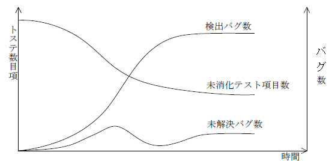

# モジュール分割技法

## STS分割
プログラムの流れを入力（源泉：Source)／処理（変換：Transform)／出力（吸収：Sink）の三つの部分に分割し，それぞれをモジュールとする技法

## 共通機能分割
分割した複数のモジュールに共通の機能がある場合，その機能を独立した一つのモジュールとして分割する技法である。

## ジャクソン法
入力データと出力データを分析し，出力データの構造に合わせてモジュール分割する技法

## トランザクション分割（TR分割）
データの種類によって処理が異なるような場合に，各処理をモジュールとして分割する技法

# ソフトウェア方式設計
ソフトウェア構成品目に関する要件を，最上位レベルの構造を表現する，ソフトウェアコンポーネントを識別できる方式に変換し，ソフトウェア方式設計書として文書化する。また，ソフトウェア結合の暫定的なテスト要件及びスケジュールを定義し，ソフトウェア結合テスト仕様書として文書化する。

# 構成管理
ソフトウェア開発のプロジェクト又はプロセスの出力(成果物)の完全性を確立・維持し,関係する当事者が維持できるように管理する。

> 例.ソフトウェア開発において，構成管理に起因する問題
- 同じプログラムに複数のバージョンが存在し，修正すべき最新バージョンのプログラムを特定できない。
  - （プログラム（ソフトウェア）のバージョン管理は，ソフトウェア構成管理プロセスのアクティビティである変更管理において，“構成状況の記録”で行うべきことである。

# ソフトウェア開発モデル

## ウォータフォールモデル
開発工程を複数の段階に分割し，段階ごとに開発を進めていく手法である。上流工程の誤りによって後戻りが発生すると，ソフトウェアの開発効率が著しく低下する。

## スパイラルモデル
アプリケーションの部分単位に設計・開発・テストを行い，これを繰り返す

## プロトタイプモデル（プロトタイピング）
動作可能な試作品を作成し，要求仕様の確認・評価を早期に行う

## RAD（Rapid Application Development）
ユーザの参画，少人数による開発，開発ツールの活用によって，ソフトウェアを短期間で開発する

# ホワイトボックステスト
ソフトウェアユニット(モジュール)の内部仕様(アルゴリズム,ロジック,経路)に着目して実施するテストである。
## 判定条件網羅
ホワイトボックステストにおいて，すべての判定条件に対して，真／偽を少なくとも１回は実行するようにテストケースを設計する。

`例題` 
プログラム中に次の複合判定がある。

　条件1　OR　（条件2　AND　条件3）

判定条件網羅に基づいてテストする場合，〔終了したテスト項目〕の(1)，(2)ではテスト網羅性を満たしていない。追加するテスト項目として，適切なものはどれか。

〔終了したテスト項目〕

(1) 条件1が真，条件2が偽，条件3が偽

(2) 条件1が偽，条件2が真，条件3が真

- a.条件1：真，条件2：真，条件3：真
- b.条件1：真，条件2：偽，条件3：真
- c.条件1：偽，条件2：偽，条件3：真
- d.条件1：真，条件2：真，条件3：偽

`解答` c

# コードオーディタ
作成したプログラム（ソースコード）が，あらかじめ定められたコーディング基準に従っているかを検証するツール

# コード補完
変数名を入力していくと，入力途中で変数名の候補をメニューで表示する

# 構造化プログラミング
三つの基本構造の組合せでプログラムを作成する

# シンタックスハイライト
命令を入力すると，入力した命令の種類に応じた色で表示する

# プログラムテスト

`例題`

プログラムテストにおいて，図のようにすべての線が横ばい状態になった。このグラフから推測できるテストの状況はどれか

- a. バグの発生とテスト項目の消化の比率が一致し，未解決バグがなくなった。
- b. 解決困難なバグに直面しており，その後のテストが進んでいない。
- c. バグが多発し，テスト項目の消化実績が上がらなくなった。
- d. テスト項目の消化実績が上がっており，バグの発生がなくなった。

未消化テスト項目数が横ばい状態であることからテストが進んでいないこと，及び未解決バグ数が横ばい状態であることからバグが解決していないことがわかる。したがって，解決困難なバグに直面しており，テストが進んでいないと考えられる。

`解答` b

# モジュール結合度
モジュール結合度は他のモジュールとの関連性を表す指標で，結合度が弱いほどモジュールの独立性が高い，良いモジュールといえる。モジュールの独立性が高い（モジュール結合度が弱い）順に並べると，次のようになる。

データ結合<スタンプ結合<制御結合<外部結合<共通結合<内容結合

# HIPO(Hierarchy plus Input Process Output)
ソフトウェアの機能・処理を階層構造で表す図式化手法である。図式目次（階層構造図）と，総括ダイアグラム／詳細ダイアグラムという二つのIPO ダイグラムで構成される。

# システム方式設計プロセス
システム要件をどのようにシステム要素（ハードウェア，ソフトウェアなど）に割り当てることが望ましいかを識別する。システムの最上位の方式として，ハードウェア構成品目，ソフトウェア構成品目及び手作業を明確にする。

# システム結合プロセス
システム設計及びシステム要件に表現された利害関係者の期待を満たす完全なシステムを作り出すために，システム要素を結合する。

# システム導入プロセス
合意したシステム要件を満たすシステムを，実環境（実際に運用する環境）に導入する。

# システム要件定義プロセス
定義された利害関係者要件を，システムの設計に利用できる技術的要件（システム要件）に変換する。

# トップダウンテスト
最上位のモジュールから下位モジュールへと結合していくテストである。そのため，上位モジュールが何度もテストに使用されることになるので，上位モジュールの信頼性が高くなる。

# エクストリームプログラミング
設計段階を単純化して，プログラミングとテストを充実させる開発技法である。各工程を順序立てて進めていくことよりも，常にフィードバックして修正・再設計していくこと，及びコミュニケーションを重視する。

# テスト駆動開発
テスト設計を先に行い（テストファースト），そのテストを通過するプログラムを作成する手法

# ペアプログラミング
二人一組でプログラミングを行う手法である。一方が作成したプログラムを，もう一方がチェックしながらナビゲート（指示）する。

# リファクタリング
完成済みのコードを，外部から見た動作（振舞い）を変更せずに改善していく手法

# 保守

## 適用保守
システム納入後に，環境の変化（消費税の変更）などによって発生した問題を解決するために実施する保守(プログラムの改良)

## 遠隔保守
現場を訪れずに，遠隔地から行う保守

## 是正保守
ステム納入後に発見された問題（システム要件を満たさない事項）を解決するために実施する保守（プログラムの修正）

## 日常保守
システムを構成する機器について，日頃から監視する保守

# インヘリタンス（継承）
上位クラスで定義された性質が下位クラスへと継承されること

# オーバライド（再定義）
スーパクラスで定義したメソッドを，継承した下位クラスで書き換えること

# デリゲーション（委譲）
別のクラス（オブジェクト）に処理を委託すること

# ポリモフィズム（多相性，多様性，多態性）
同一メッセージに対する動作（振舞い）がクラス（オブジェクト）ごとに異なること

# インスペクタ
実行中のプログラムで使用されている変数の値などを出力する開発ツール（テスト実施支援ツール）である。プログラムの実行状態を追跡するトレーサと併用されることが多い。

# アサーションチェッカ
特定の時点で成立する変数間の関係や条件を記述した論理式を埋め込んで，プログラムの正当性を検証する（アサーションチェック）開発ツール（テスト実施支援ツール）である。

# エミュレータ
異なるOS などの環境を擬似的に作成して，他機種のプログラムを自機種で実行する開発ツール（マイクロプログラム）である。

# メモリダンプ
主記憶装置の状態を，ダンプファイルに出力する開発ツール（テスト実施支援ツール）である。

# ソフトウェア品質特性（JIS X 25010）
JIS X 25010 では，ソフトウェア品質特性として“利用時の品質モデル”と“製品品質モデル”を規定している。信頼性は“製品品質モデル”の一つであり，「明示された時間帯で，明示された条件下に，システム，製品又は構成要素が明示された機能を実行する度合い」である。

# シーケンス図
オブジェクトなどのメッセージのやり取りを表現する相互作用図の一つで，メッセージの送信とオブジェクトのライフラインを時系列で表現する図

# ステートマシン図（ステートチャート図
オブジェクトの状態遷移を表現する図で，オブジェクトのライフサイクルを整理する目的などで利用される

# ユースケース図
外部から見たシステムの機能を表現する図で，要件定義などで機能要件を整理する目的などで利用される

# クラス図
クラス間の関係を表現する図で，データモデルとしてデータの関係を整理する目的などで利用される

