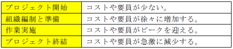

# デルファイ法
アンケートなどにより複数の専門家から収集した匿名の見解を要約して，再配布することを何度か繰り返すことで収束する（合意を得る）手法

# 定性的リスク分析
リスクの発生確率（又は発生頻度）やリスクが顕在化したときの影響度から，リスクに優先順位を付け，リスク登録簿に記載するリスク評価方法

# ブレーンストーミング
プロジェクトチーム及び外部の専門家集団を交えて自由闊達な意見交換を行い，プロジェクトのリスクを出し合う手法

# モンテカルロ法
確率分布や乱数を使用したシミュレーション／数値解析を数多く行うことにより，リスクを特定する手法

# 三点見積法
楽観値，悲観値，最頻値（平均的な値）を使用して見積もる手法

`例題`

あるプロジェクトで行われる作業は，熟練社員であれば１日，一般的な社員であれば２日で終わるが，作業に慣れていない新入社員などでは６日かかると予測されている。この作業の所要期間を，次の計算式で３日と見積もる手法はどれか。

`解答`

作業の所要期間の見積り＝(1＋2＋6)÷3＝3 日なので、三点見積法


# 係数見積法（パラメトリック見積法）
過去の情報を統計的に分析して各種係数を求め，見積もる手法

# 予備設定分析
あらかじめ予備（バッファ）を設けて見積もる手法

# 類推見積法
過去の類似プロジェクトの実績をもとに，相対的に見積もる手法

# プロジェクト憲章
組織が正式に認可した**プロジェクトの発足**を宣言する文書である。プロジェクト憲章の記載事項としては，プロジェクト正式名称，オーナ/発注者/承認者/提唱者，工程/納期/全体スケジュール概要，「プロジェクトの目的や妥当性」/目標や成功基準，契約範囲と契約外事項，顧客のニーズや要求事項，プロジェクト作業範囲記述書，組織や関係機関に関わる前提上演・制約条件，全体の概算予算，プロジェクトマネージャ・メンバなどの任命/責任・権限の規定，組織の資産などがある．

# EVM 
作業の生産性（パフォーマンス）を，出来高の価値（通常は金額換算）によって定量化して評価する手法。

PV（出来高計画値），EV（出来高実績値），AC（コスト実績値）を用いる指標として，SV（スケジュール差異）とCV（コスト差異）があり，プロジェクトの進捗が予定より遅れている場合は，SV（＝ EV － PV）が０より小さくなる。

- PV（出来高計画値）: 作成期限までに完了しているものとして計画された作業の予算。
- EV（出来高実績値）: 出来高と呼ばれるある時点までに完了した作業を、その作業の計画価値に対する比から算出される値。 成果物の完成状況をあらわす。 
- AC（コスト実績値）: 現時点までに開発したコスト。

1. プロジェクトの進捗が予定より遅れている場合 : EV － PV ＜ 0
2. プロジェクトの生産性が高い状況 : EV － AC ＞ 0
3. プロジェクトの生産性が低い状況 : EV － AC ＜ 0
4. プロジェクトの進捗が予定より進んでいる状況 : EV － PV ＞ 0

# コミュニケーション方法

## プッシュ型コミュニケーション
手紙，電子メール，ボイスメール，報告書，ファックスなど，特定の受信者に対して送信される情報配布の方法

## 相互型コミュニケーション（双方向型コミュニケーション）
会議，電話，テレビ会議など，２人以上の当事者間で相互に情報交換を行う方法

## フィードバック型コミュニケーション
問合せに対して応答（フィードバック）するコミュニケーションである。相互に意見交換するフィードバックループになる相互型コミュニケーションの別称として用いられることもある。

## プル型コミュニケーション
インターネットやイントラネットのWeb サイト，新聞／雑誌の紙面などに対して，受信者自身の意思でアクセスして情報を取得する情報配布の方法である。不特定多数の受信者や情報量が膨大な場合などに使用される。

# プロジェクトライフサイクル
プロジェクトの開始から終結までのライフサイクルである。一般的なプロジェクトライフサイクルは，次のようになる。



# 開発工数の計算

`例題`

10人の開発要員によって，30日間で完了する予定で開発したプログラム作業がある．しかし，別の作業に遅れが生じて開発要員を支援に送ったため，10日目が終了した時点で開発工数の20%しか終了しなかった．予定の30日間でプログラミング作業を完了するためには，少なくとも何名の開発要員を追加すればよいか．ここで，追加する開発要員の生産性は，現在の開発要員と同じとする．

`解答`

1. プログラミング作業の開発工数を求める
   
   プログラミング作業の開発工数＝開発要員×開発期間＝10人×30日＝300人日

2. 10日目の時点で残っている開発工数を求める
残っている開発工数＝300人日×（1-0.2）＝240人日

3. 予定の30日間でプログラミング作業を完了するために必要な開発要員数を求める
  必要な開発要員数＝残れっている開発工数÷残っている開発期間＝240人日÷（30日-10日）＝12人

4. 追加する開発要員数を求める
  追加する開発要員数＝必要な開発要員数-現在の開発要員数＝12人-10人＝2人

# プロジェクトの品質

## 品質保証の遂行
目的は，成果物及びプロジェクトをレビューすることである．プロジェクトで定めた品質基準を確実に満たすために，成果物やプロジェクトに対する品質監査を実施する．

## 品質管理の遂行
- プロジェクトの遂行結果が，定められた品質基準に適合しているかどうかを検査する
- プロジェクトで定めた品質基準に対して不満足な結果が発生したときに，その原因を取り除くための方法を決め

## 品質の計画
プロジェクトの遂行結果に対する適切な品質基準を設定し，それを満たす手順を定める

## WBS（Work Breakdown Structure）
WBS（Work Breakdown Structure；作業階層構造図）の作成の目的は，プロジェクトの目標を達成するために完了する必要のある作業を表すための，階層的分割の枠組みを提供することである．プロジェクトで実施する作業を，トップダウン方式で細分化することで，作業管理をしやすくする．

## ファンクションポイント法（FP 法：Function Point 法）
画面数や帳票数などから得られるソフトウェアの機能（ファンクション）によって，開発コストや開発工数を見積もる手法

`例題`

あるアプリケーションプログラムの，ファンクションポイント法によるファンクションタイプごとの測定個数及び重み付け係数は，次の表のとおりである。このアプリケーションプログラムのファンクションポイントは幾らか。ここで，複雑度の補正係数は0.75 とする。


`解答`

各ファクションタイプのファンクションポイントを合計して，未調整ファンクションポイントを求める。
```
　未調整ファンクションポイント
　　＝Σ(ファンクションタイプの測定個数×重み付け係数)
　　＝1×4＋2×5＋1×10＋0×7＋0×4
　　＝24
```
未調整ファンクションポイントに複雑度の補正係数（0.75）を掛けて，このアプリケーションプログラムの調整済みファンクションポイントを求める。

```
　調整済ファンクションポイント
　　＝未調整ファンクションポイント×複雑度の補正係数
　　＝24×0.75
　　＝18
```

正答: 18


