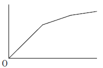

# 逓減課金方式
リソースの使用量が多くなるにつれて利用金額が安くなる方式

# UPS（Uninterruptible Power Supply；無停電電源装置）
商用電源の瞬断（瞬間的な電力供給の中断）に対処したり，停電したときにシステムを正常に終了させる間だけ電力を供給したりする装置である。

# AVR（Automatic Voltage Regulator；自動電圧調整器）
電源電圧のノイズを吸収・調整して，商用電力を安定供給する装置である。

# CVCF（Constant Voltage Constant Frequency；定電圧定周波数装置）
停電時に電源を自家発電装置に切り換えるまでの間，電源を供給する装置である。

# SPD（Surge Protective Device；サージ防護デバイス）
過電圧（サージ電圧）や過電圧により生じる過電流（サージ電流）から，電源回路及び通信機器などを保護（サージ防護）する機器である。

# ITSMS 認証制度
- **Step１**（ギャップ分析）：サービスマネジメントの現状を調査し，要求事項とのギャップを洗い出す。
- **Step２**（サービスマネジメントシステムの構築）：経営陣を含めたサービスマネジメント組織を編制し，サービスの品質についての責任を明確にする。さらに，サービスの運営管理を適正に行えるように，運用方法／マニュアルの文書化，運用管理者の教育・訓練などを立案する。（正解）
- **Step３**（サービスマネジメント計画の導入）：サービスマネジメント計画を立案・導入する。
- **Step４**（サービスマネジメントプロセスの導入）：サービスマネジメント計画に従って，新規サービス又はサービス変更の設計及び移行，並びにサービスマネジメントプロセスを導入する。

# サービスマネジメントの変更管理プロセスにおける変更要求の扱い
- 変更管理では，承認・未承認に関係なく，最初にすべての変更要求を記録する。
- 緊急の変更要求の対応は顧客との合意で決められるが，実装はリリース及び展開管理で行う
- 変更要求の内容に応じて，優先順位を付けるべきである
- 変更要求の受入れについては，財務的な影響（コスト）などを考慮して決定する

# インシデント及びサービス要求管理
顧客と合意したサービスを可能な限り迅速に回復するために，インシデントの対応又はサービス要求の対応を行う。インシデント及びサービス要求管理の主な活動は，インシデントの発生・検出から暫定的な解決（サービスの復旧）までである。

# サービスレベル合意書（SLA）
サービス及びサービス目標を特定した，サービス提供者と顧客との間の合意文書（契約書などに含める場合もある）である。適用範囲，提供サービス，提供時間（問合せ受付時間），目標と評価（オンラインシステム障害時の復旧時間），課金（課金項目）などが記載される。また，契約事項が満たされなかった場合に，料金の一部を返還するなどの罰則規定が含まれる場合もある。

# 守秘契約（NDA：Non Disclosure Agreement）
外部協力会社との新しい運用サービスの契約形態であり，機密情報漏えいに関する規定などを契約に盛り込むことによって，企業機密を保護するためのものである。

# 情報システム部門のKGI（Key Goal Indicator：重要目標達成指標）
経営層から見た情報システム部門の評価指標であり，年度計画における情報システム部門の目標達成数値である。例えば，開発予算，開発生産性，トラブル件数などが盛り込まれる

# 雇用契約
情報システム要員が企業と取り交わす合意書であり，労働環境が複雑な情報システム要員に対して，適用する賃金体系，勤務時間，トラブルなどの緊急時の対応方法を規定したもの

# サービスライフサイクル
戦略，設計，移行，運用，継続的改善の視点から，サービスマネジメントを体系化するITIL v3 の考え方である。

# サービスサポート
ITサービス全体にわたって，日常行われる運用管理である。

# サービスストラテジ
サービスに関する組織の方針と達成目標を決定する。

# サービストランジション
新しいサービスの導入，又は既存サービスの修正を行う。

# システムの移行方式
## 一斉移行方式
新旧システムを並行運用することによる作業の二重負担を避けることができるので，大きな経済的効果を得ることができる。一斉移行方式は，システム全体を一斉に置き換えて稼働させるため，新旧システムを並行して運用する並行移行などに比べて，コストがかからないため。

# ヘルプデスク（サービスデスク）
受付と記録，問題判別及び一次対応（応急処置），対応結果の記録である。“原因究明への優先度設定”及び“原因の究明と問題解決”は，解決プロセスのインシデント及び要求管理，問題管理として，一次対応（応急処置）の後に実施する。

受付と記録→問題判別→応急処置→原因究明への優先度設定→原因の究明と問題解決

# KPI（重要業績評価指標）
## サービス継続及び可用性管理
サービス継続及び可用性管理は，平常な状況とサービス中断後の状況の下で，顧客と合意したサービス継続性及び可用性についての要求事項を確実に実施するプロセス

## 情報セキュリティ管理のKPI
情報セキュリティインシデントの発生回数

## 容量・能力管理（キャパシティ管理）のKPI 
性能不足に起因するインシデントの発生回数

## サービスレベル管理（SLM：Service Level Management）のKPI 
目標を達成できなかったサービスレベル要件数

